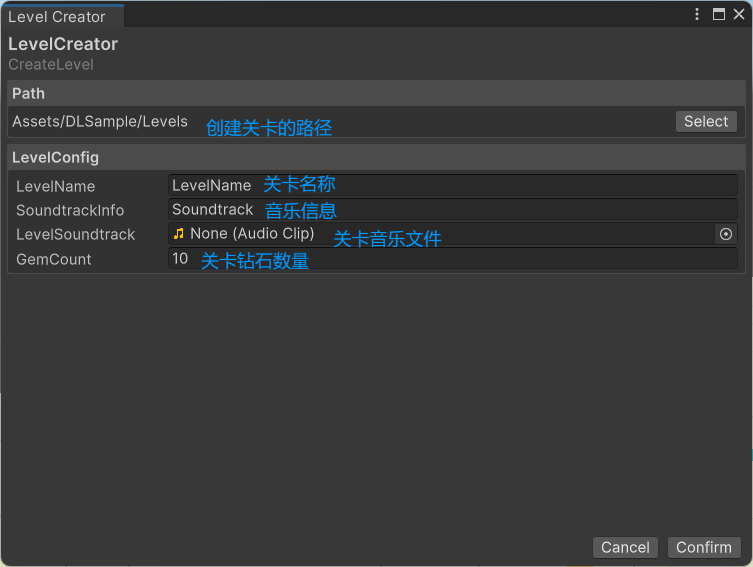
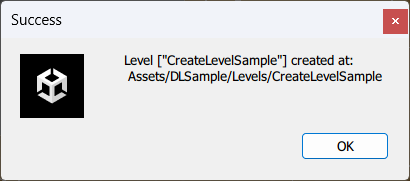
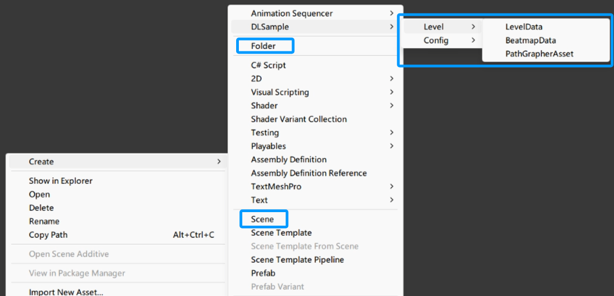

# 创建关卡

你可以直接使用模板内置的示例场景(```Assets/DLSample/Levels/_Sample/SampleLevel```)直接开始制作关卡，也可以按照下面的步骤创建一个全新的关卡

DLSample提供了创建关卡的快捷方式，当然也可以根据自己的需求手动创建关卡。

## 一.快捷创建

1. 找到Unity顶部工具栏中的DLSample，点击CreateLevel
2. 出现LevelCreator窗口，在Path栏中选择你想创建关卡的位置，在LevelConfig栏中填入你的关卡名称等信息，点击Confirm。
   
一般情况下，建议将关卡创建在`Assets/DLSample/Levels/`目录下。

各参数说明:
- `LevelName`关卡名称
- `SoundtrackInfo`关卡音乐信息
- `LevelSoundtrack`关卡音频文件，如果没有可以先不填，此处只用作关卡长度计算
- `GemCount`关卡宝石数
- 以上数据会保存到 `<LevelName>/LevelData_<LevelName>`下



3. 创建成功


## 二.手动创建
### 1. 创建场景
1. 在Project窗口下，选择你想要创建关卡的文件夹(推荐```Assets/DLSample/Levels/```)，单击鼠标右键，选择Create -> Folder，将文件夹命名为你的关卡名称。
2. 进入刚刚创建的文件夹，单击鼠标右键，找到 Create -> Scene， 同样，为场景命名。
### 2. 创建关卡配置文件
1. 在1.1创建的文件夹下，右键，找到Create -> DLSample -> Level -> ... , 可以看到LevelData, BeatmapData, PathGrapherAsset三个选项，依次创建。



## 接下来

1. 进入刚刚创建的关卡目录，看看是否创建了LevelData, Beatmapata, PathGrapherAsset以及场景文件